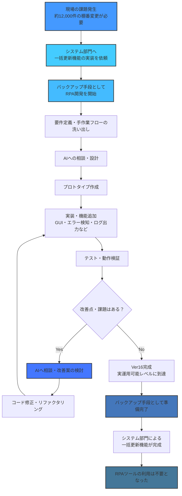

# 開発フローチャート

本プロジェクトにおいて、AIを活用しながら業務自動化ツールを構築した際の開発プロセスフローです。

```mermaid
graph TD
    A[現場の課題発生<br/>約12,000件の棚番変更が必要]
        --> B[システム部門へ<br/>一括更新機能の実装を依頼]

    B --> C[バックアップ手段として<br/>RPA開発を開始]

    C --> D[要件定義・手作業フローの洗い出し]
    D --> E[AIへの相談・設計]
    E --> F[プロトタイプ作成]

    F --> G[実装・機能追加<br/>GUI・エラー検知・ログ出力など]

    G --> H[テスト・動作検証]

    H --> I{改善点・課題はある？}

    I -->|Yes| J[AIへ相談・改善案の検討]
    J --> K[コード修正・リファクタリング]
    K --> G

    I -->|No| L[Ver16完成<br/>実運用可能レベルに到達]

    L --> M[バックアップ手段として準備完了]

    M --> N[システム部門による<br/>一括更新機能が完成]

    N --> O[RPAツールの利用は不要となった]

    style A fill:#49f,stroke:#333,stroke-width:2px
    style B fill:#4cf,stroke:#333,stroke-width:2px
    style C fill:#4bf,stroke:#333,stroke-width:2px
    style J fill:#47f,stroke:#333,stroke-width:2px
    style M fill:#47b,stroke:#333,stroke-width:2px
    style O fill:#479,stroke:#333,stroke-width:2px
```