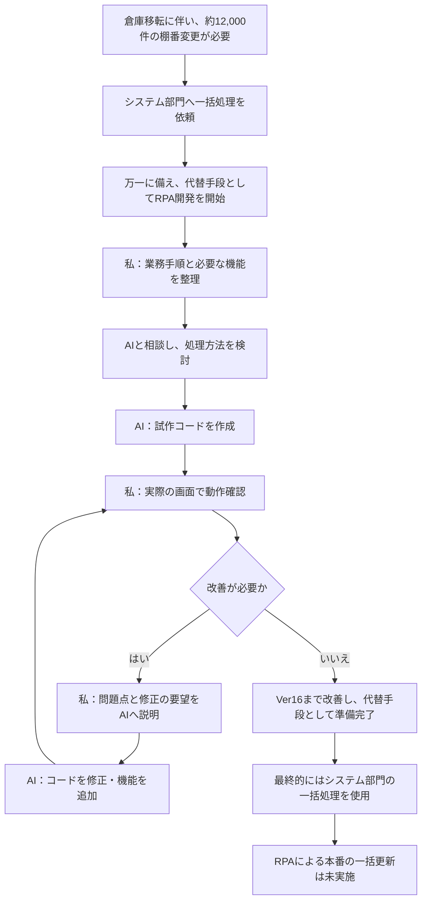

# 開発フローチャート

棚番一括変更RPAを、万一に備えた代替手段として準備した流れです。
コードの作成・修正はAIが担当し、私は業務手順の整理、動作確認、改善内容の判断を担当しました。

```mermaid
flowchart TD
    A["倉庫移転に伴い、約12,000件の棚番変更が必要"]
    A --> B["システム部門へ一括処理を依頼"]
    B --> C["万一に備え、代替手段としてRPA開発を開始"]

    C --> D["私：業務手順と必要な機能を整理"]
    D --> E["AIと相談し、処理方法を検討"]
    E --> F["AI：試作コードを作成"]
    F --> G["私：実際の画面で動作確認"]

    G --> H{"改善が必要か"}
    H -->|はい| I["私：問題点と修正の要望をAIへ説明"]
    I --> J["AI：コードを修正・機能を追加"]
    J --> G

    H -->|いいえ| K["Ver16まで改善し、代替手段として準備完了"]
    K --> L["最終的にはシステム部門の一括処理を使用"]
    L --> M["RPAによる本番の一括更新は未実施"]
```

開発の詳しい経緯は、[development_history.md](development_history.md)を参照してください。